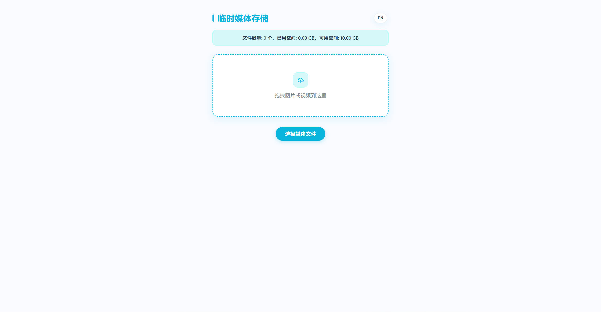
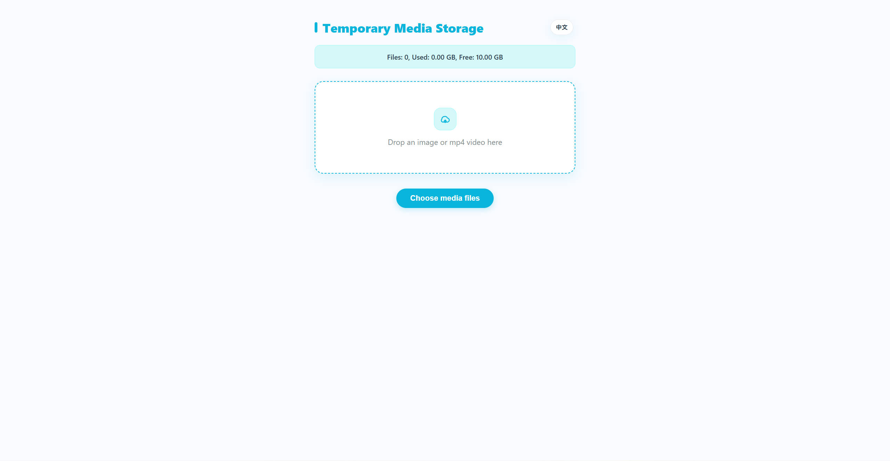

## Temporary Media Storage (Cloudflare Worker + R2)

[](https://deploy.workers.cloudflare.com/?url=https://github.com/al01cn/Temporary-media-storage-cloudflare.git)

A lightweight temporary media storage tool designed for **Cloudflare Workers**, using **Cloudflare R2** as the storage backend. It enforces a strict **10GB** total storage cap on uploads to help you stay within the free storage tier.

It ships with a simple Web UI (CN/EN switch, default follows your browser language) for upload, preview, copy link, delete, and storage stats. Expired files are cleaned up automatically.

### Screenshots

Chinese UI:



English UI:



---

## Features

- Web UI: upload / preview / copy link (with fallbacks) / delete (with confirmation) / storage stats
- Allowed file types:
  - Images: png / jpg / jpeg / gif / webp
  - Videos: mp4 only
- Naming convention: uploaded files are renamed to `Image_<timestamp>.<ext>` / `Video_<timestamp>.<ext>`
- Storage cap: **10GB** total (upload is rejected if it would exceed the cap)
- Auto cleanup: scheduled job removes files **older than 3 days**
- No indexing: page meta defaults to `noindex, nofollow` to discourage search engines

---

## Bindings & Configuration

This Worker requires an R2 bucket binding named `aloss`.

- R2 Bucket Binding: `aloss`

Built-in limits (hardcoded):

- Total storage cap: 10GB
- Max file size: 50MB per upload

---

## Deployment

### One-click deploy (Deploy to Cloudflare)

Before using the one-click deploy, make sure **Cloudflare R2 is enabled** on your account (this Worker requires an R2 bucket binding). If R2 is not enabled, deployment/bindings will fail.

Push this project to a **public GitHub/GitLab repository**, then replace `https://github.com/al01cn/Temporary-media-storage-cloudflare.git` in the button link above with your repo URL. Cloudflare will clone and deploy it into your account.

Button link format (official):

`https://deploy.workers.cloudflare.com/?url=https://github.com/al01cn/Temporary-media-storage-cloudflare.git`

### Option A: Cloudflare Dashboard (recommended)

1. Cloudflare Dashboard → Workers & Pages → Workers
2. Create a Worker, paste the content of [_worker.js](./_worker.js), then save
3. Worker Settings → Bindings:
   - Add an R2 bucket binding named `aloss` and select your bucket
4. (Optional) Enable a Cron Trigger for the 3-day cleanup

### Option B: Wrangler (optional)

If you prefer Wrangler, use the repo-provided [wrangler.toml](./wrangler.toml):

```toml
... (see wrangler.toml)
```

---

## API Endpoints

- `GET /`: Web UI
- `PUT /upload/<key>`: upload (the UI generates the key)
- `GET /file/<key>`: fetch file (`cache-control: public, max-age=3600`)
- `DELETE /delete/<key>`: delete file
- `GET /list`: list all keys (JSON array)
- `GET /stats`: stats (JSON: `totalFiles / totalGB / remainingGB`)

---

## Notes

- No authentication by default: anyone who can access your Worker can list and delete files. Consider Cloudflare Access/WAF or Worker-side auth before exposing it publicly.
- To strictly enforce the 10GB cap, each upload performs an `R2.list()` to calculate used bytes. This trades simplicity for correctness and can add overhead when you store many objects.
